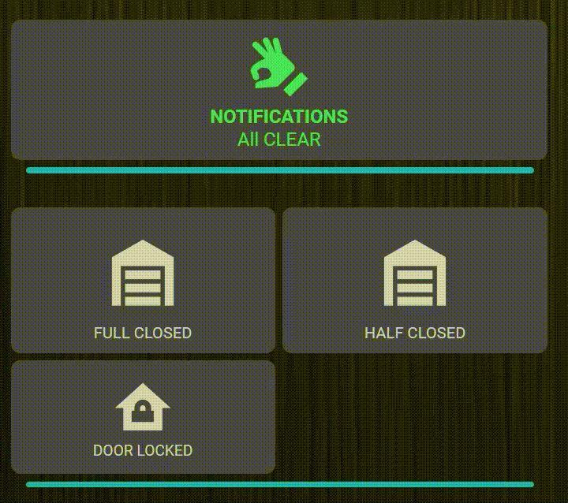

# Combined Notifications Integration

A custom integration for Home Assistant that creates sensor entities which group together multiple notification conditions with customizable styling and alert states.



## 🚀 Features

- **Entity Grouping**: Monitor multiple entities with a single notification sensor
- **Condition-based Alerts**: Define custom conditions with operators (equals, not equals, greater than, less than)
- **Customizable Appearance**: Set colors, icons, and other visual elements
- **Flexible Display Options**: Works with multiple dashboard card types

## 📦 Installation

### HACS Installation (Recommended)

1. Go to HACS in Home Assistant
2. Click the three dots menu in the upper right corner
3. Select "Custom repositories"
4. Add this repo:
   ```
   https://github.com/Pjarbit/home-assistant-combined-notifications
   ```
5. Select "Integration" as the repository type
6. Click "ADD"
7. Search for "Combined Notifications" in HACS
8. Click Install
9. Restart Home Assistant
10. Go to **Settings > Devices & Services > Add Integration** and search for "Combined Notifications"

### Manual Installation

1. Download the latest release from the [releases page](https://github.com/Pjarbit/home-assistant-combined-notifications/releases)
2. Create a folder named `combined_notifications` in your `config/custom_components/` directory
3. Extract the contents of the release into this folder
4. Restart Home Assistant
5. Go to **Settings > Devices & Services > Add Integration** and search for "Combined Notifications"

## ⚙️ Configuration

The integration is configured via a user-friendly UI:

1. After adding the integration, provide a name for your notification group
2. Configure appearance settings (colors, icons)
3. Add condition entities to monitor
4. For each entity, specify:
   - The entity ID to monitor
   - The condition operator (equals, not equals, greater than, less than)
   - The trigger value
   - A friendly name (optional)

## 🔄 Display Options

This integration creates notification sensor entities that can be displayed in multiple ways on your dashboard. Choose the option that best fits your needs:

### Option 1: Combined Notifications Card (Recommended)

For the best experience, use our dedicated [Combined Notifications Card](https://github.com/Pjarbit/home-assistant-combined-notifications-card-new):

```yaml
type: custom:combined-notifications-card
entity: sensor.your_notification_group
header_name: Important Alerts
text_all_clear: All Systems Normal
background_color_all_clear: green
background_color_alert: red
icon_all_clear: mdi:check-circle
icon_alert: mdi:alert-circle
```

### Option 2: Using button-card

If you already use button-card in your setup, you can achieve similar functionality:

```yaml
type: custom:button-card
entity: sensor.your_notification_group
name: NOTIFICATIONS
show_name: true
show_icon: true
show_state: false
styles:
  card:
    - background-color: >
        [[[ if (entity.state !== "") { return "rgba(255, 0, 0, 0.7)"; } else {
        return "rgba(67, 73, 82, 1)"; } ]]]
    - border-radius: 10px
    - padding: 10px
    - color: >
        [[[ if (entity.state === "") { return "rgb(47, 207, 118)"; } else {
        return "rgb(255, 255, 255)"; } ]]]
  name:
    - font-weight: bold
  icon:
    - color: >
        [[[ if (entity.state === "") { return "rgb(47, 207, 118)"; } else {
        return "rgb(255, 255, 255)"; } ]]]
icon: >
  [[[ if (entity.state !== "") { return "mdi:alert-circle"; } else { return
  "mdi:hand-okay"; } ]]]
show_label: true
label: >
  [[[ if (entity.state !== "") { return entity.state; } else { return "All
  CLEAR"; } ]]]
```

### Option 3: Standard Entity Card

For a simple approach, you can use the built-in entity card:

```yaml
type: entities
entities:
  - entity: sensor.your_notification_group
    name: System Notifications
```

## 📋 Example Use Cases

- **Home Security**: Monitor door/window sensors, motion detectors, and alarm states
- **Device Status**: Track battery levels, connectivity issues, and offline devices
- **System Alerts**: Monitor disk space, CPU usage, or temperature sensors
- **Home Maintenance**: Track filter replacements, water leaks, or other maintenance needs

## ⚠️ Troubleshooting

**Common Issues:**
- If entities aren't updating properly, check that they are providing state changes
- Verify that condition operators and trigger values match your expectations
- For numeric comparisons, ensure values are properly formatted
- Restart Home Assistant after making significant changes

## 🤝 Contributing

Contributions are welcome! Please feel free to submit a Pull Request.

## 📜 License

This project is licensed under the MIT License - see the LICENSE file for details.

---

Made with ❤️ for the Home Assistant Community

Made with ❤️ for the Home Assistant Community
